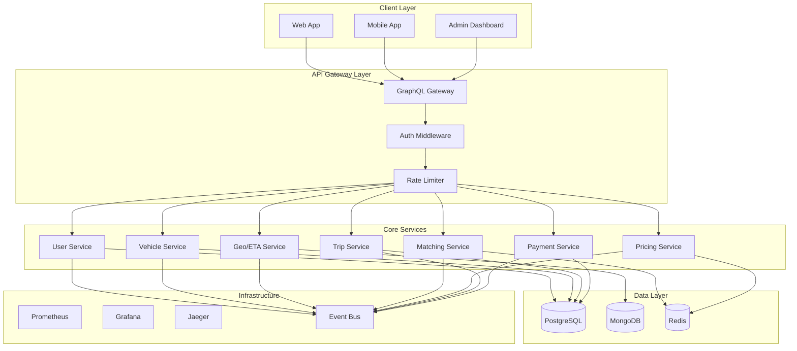
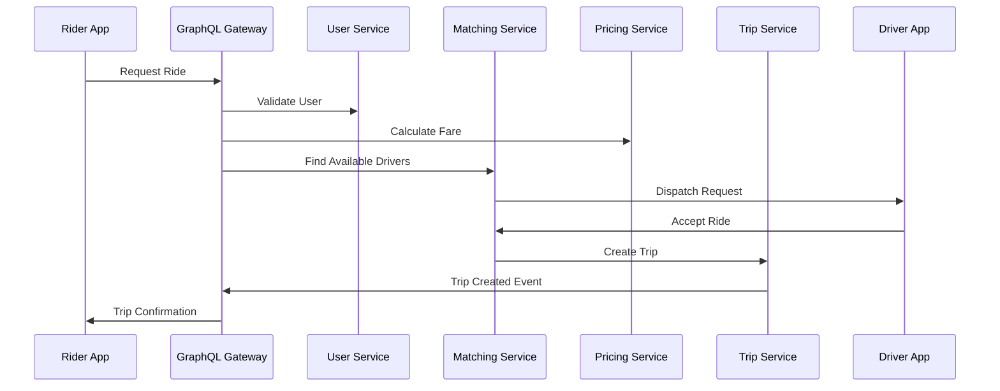

# Rideshare Platform Architecture

## System Architecture Overview

This document outlines the comprehensive architecture for a production-grade rideshare simulation platform built with Go, GraphQL, and gRPC.

### Core Architecture Principles
- **Event-Driven Architecture**: Services communicate via events for loose coupling
- **Domain-Driven Design**: Each service owns its domain and data
- **CQRS + Event Sourcing**: For trip lifecycle and audit trails
- **API Gateway Pattern**: GraphQL gateway for client-facing APIs
- **Service Mesh**: For secure inter-service communication

### Service Architecture Diagram

## Service Boundaries and Responsibilities

### 1. User Management Service
- **Domain**: User authentication, profiles, driver/rider management
- **Database**: PostgreSQL
- **Key Features**:
  - JWT-based authentication
  - Driver verification and onboarding
  - Rider profile management
  - Role-based access control

### 2. Vehicle Management Service
- **Domain**: Vehicle registration, availability, maintenance
- **Database**: PostgreSQL
- **Key Features**:
  - Vehicle registration and verification
  - Real-time availability tracking
  - Vehicle type management (sedan, SUV, etc.)
  - Maintenance scheduling

### 3. Geospatial/ETA Service
- **Domain**: Location tracking, distance calculations, routing
- **Database**: MongoDB (geospatial indexing)
- **Key Features**:
  - Haversine distance calculations
  - Geohash-based location indexing
  - ETA predictions
  - Route optimization

### 4. Matching/Dispatch Service
- **Domain**: Driver-rider matching, dispatch optimization
- **Database**: Redis (real-time matching state)
- **Key Features**:
  - Proximity-based matching
  - Driver availability tracking
  - Intelligent dispatch algorithms
  - Real-time matching status

### 5. Pricing Service
- **Domain**: Fare calculation, surge pricing, promotions
- **Database**: Redis (dynamic pricing cache)
- **Key Features**:
  - Distance/time-based pricing
  - Surge pricing algorithms
  - Promotional discounts
  - Real-time price updates

### 6. Trip Lifecycle Service
- **Domain**: Trip state management, event sourcing
- **Database**: PostgreSQL (event store)
- **Key Features**:
  - Complete trip state machine
  - Event sourcing implementation
  - Trip history and analytics
  - State recovery mechanisms

### 7. Payment Mock Service
- **Domain**: Payment processing simulation
- **Database**: PostgreSQL
- **Key Features**:
  - Multiple payment methods
  - Transaction logging
  - Refund processing
  - Payment failure scenarios

## Technology Stack Details

### Backend Services
- **Language**: Go 1.21+
- **Framework**: Gin for HTTP, gRPC for inter-service communication
- **GraphQL**: gqlgen for schema-first development
- **Event Sourcing**: Custom implementation with PostgreSQL

### Databases
- **PostgreSQL**: Transactional data, event store
- **MongoDB**: Geospatial data, location indexing
- **Redis**: Caching, real-time state, session management

### Infrastructure
- **Container Runtime**: Docker
- **Orchestration**: Kubernetes
- **Service Mesh**: Istio (optional)
- **Monitoring**: Prometheus + Grafana
- **Tracing**: Jaeger
- **Logging**: ELK Stack

## Data Flow Architecture

## Event-Driven Communication

Key events in the system:
- `UserRegistered`
- `DriverOnline/Offline`
- `RideRequested`
- `DriverMatched`
- `TripStarted`
- `TripCompleted`
- `PaymentProcessed`

## Security Architecture

- **Authentication**: JWT tokens with refresh mechanism
- **Authorization**: RBAC with service-level permissions
- **API Security**: Rate limiting, input validation, CORS
- **Inter-service**: mTLS for gRPC communication
- **Data Protection**: Encryption at rest and in transit

## Scalability Considerations

- **Horizontal Scaling**: Stateless services with load balancing
- **Database Sharding**: Geographic-based sharding for geo data
- **Caching Strategy**: Multi-level caching (Redis, in-memory)
- **Event Streaming**: Kafka for high-throughput event processing

## Non-Functional Requirements

### Performance
- API response time < 200ms for 95th percentile
- Support 10,000+ concurrent users
- Real-time location updates with < 1s latency

### Reliability
- 99.9% uptime SLA
- Graceful degradation under load
- Circuit breakers for external dependencies

### Observability
- Distributed tracing for all requests
- Comprehensive metrics and alerting
- Structured logging with correlation IDs

### Security
- Zero-trust network architecture
- Regular security audits and penetration testing
- Compliance with data protection regulations